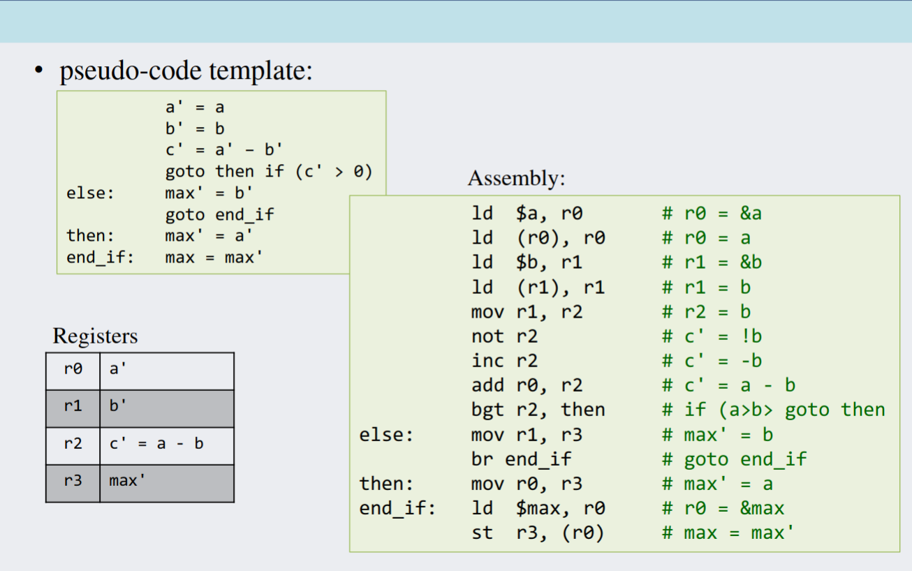
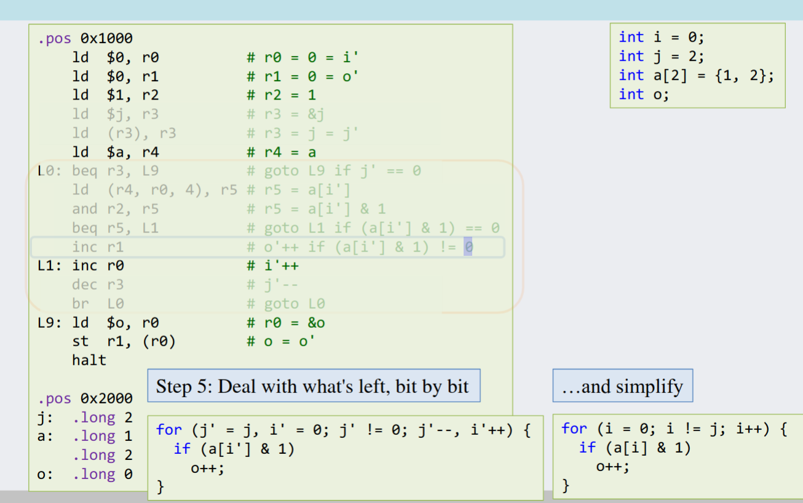
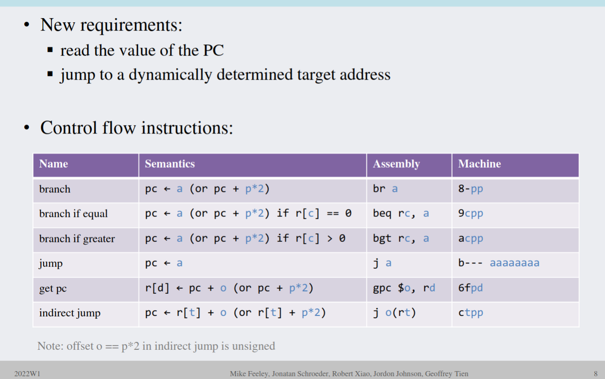

# CS213 Control flow

 
## Assembly to C convertion example
   
1. Write down comments
1. Refine comments to C
1. Look for basic blocks by examining branches
1. Associate control structure with C
1. Deal with what's left, bit by bit

## New instrucion
  
 Resources

    Your Marks by Learning Goal
    External Url
    Your Marks by Learning Goal Links to an external site.
    Context Module Sub Header
    Course Material and Resources
    213 Companion Lecture Notes
    Attachment
    213 Companion Lec